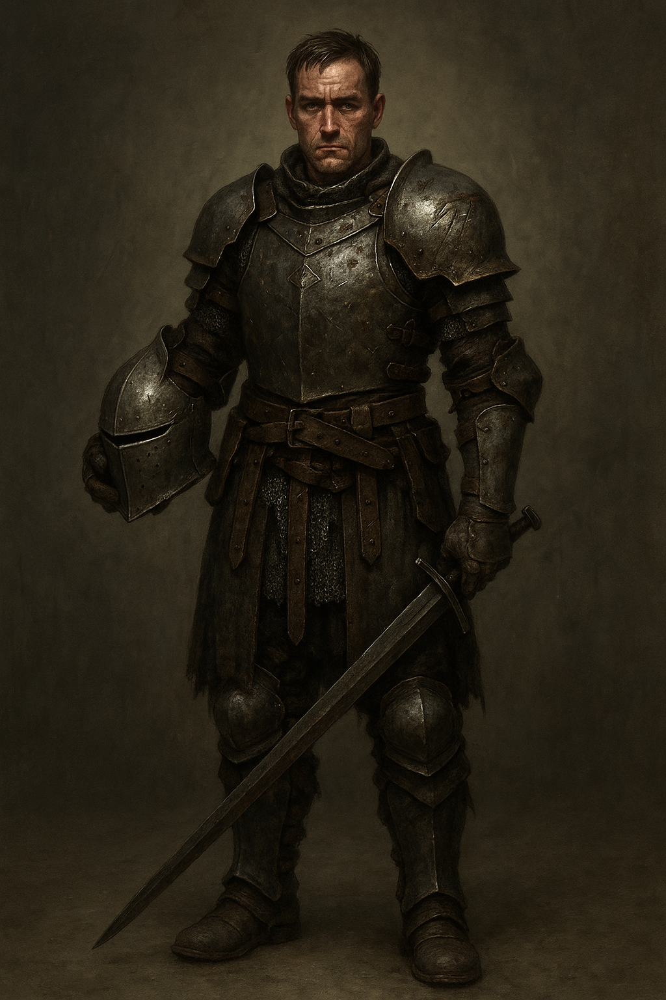
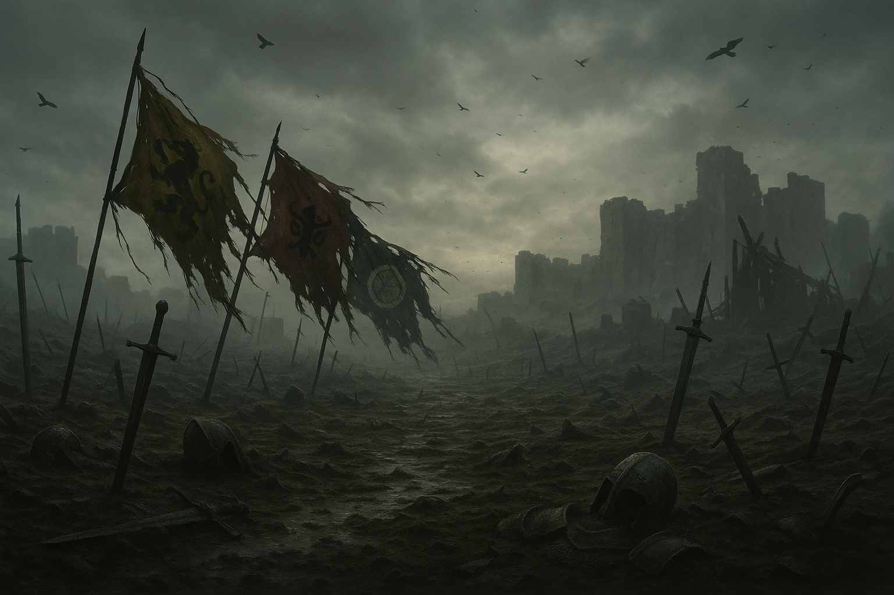
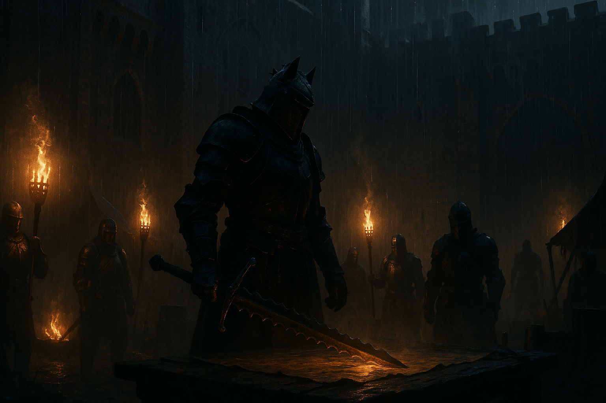
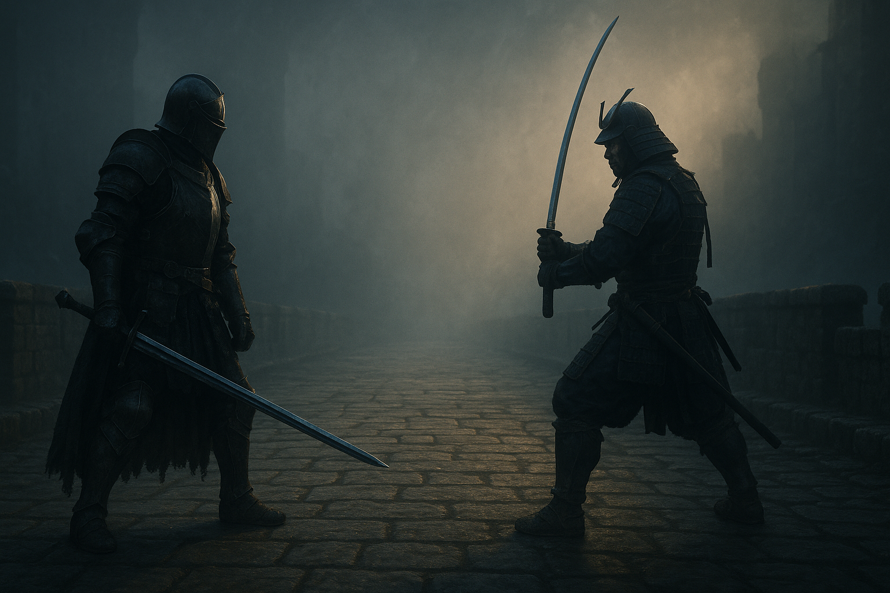
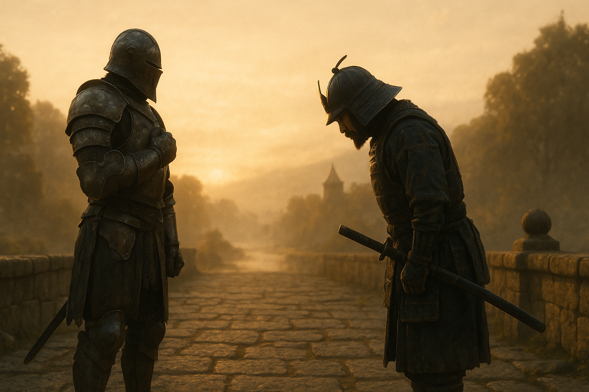

# 명예의 무게 (The Weight of Honor)
## 단편영화 프로덕션 바이블

> **최종 버전**: 2026-04-30  
> **문서 목적**: 단편 기획안 제출용

> **기반 자료**: 포아너(For Honor) 리서치 보고서, 기획안, 레퍼런스 이미지 12점

---

## Part 1: 프로젝트 개요

### 기본 정보

| 항목 | 내용 |
|------|------|
| **제목** | 명예의 무게 (The Weight of Honor) |
| **장르** | 중세 판타지 액션 드라마 |
| **러닝타임** | 10분 |
| **언어** | 극소량 한국어 대사 + 보이스오버 (사실상 무대사 영화) |
| **비율** | 2.39:1 (시네마스코프) |
| **제작 방식** | AI 이미지/영상 생성 (image2 + Seedance 2.0 / Seedance 2.0) |

### 로그라인

> 천 년간 이어진 전쟁의 끝자락, 명예를 잃은 나이트 워든과 고국을 잃은 사무라이 켄세이가 안개 낀 전장에서 마주쳐 -- 서로를 죽여야 할 이유를 묻는다.

### 시놉시스

대재앙 이후 천 년간 세 진영은 끝없이 싸워왔다. 블랙스톤 군단의 잔학 속에서 명예를 잃은 워든 에이든은 학살 명령을 거부하고 탈영한다. 황제의 명을 받아 서쪽으로 진군한 켄세이 카게마사는 바이킹 기습으로 전우를 모두 잃는다. 두 전사는 안개 낀 폐허의 다리 위에서 마주친다.

말이 통하지 않는 두 사람은 검을 들어 대화한다. 치열한 결투 끝에 결정적 일격을 앞둔 순간, 에이든은 검을 멈춘다. 카게마사도 칼을 거둔다. 그러나 언덕 너머에서 울려오는 전쟁의 뿔피리가 두 전사를 다시 전장으로 부른다.

명예란, 검을 드는 것인가 거두는 것인가 -- 답 없는 물음만이 안개 속에 남는다.

### 크리에이티브 비전 & 테마

**핵심 테마: "명예란 무엇인가"**

전쟁이 인간의 본성인지, 명예가 칼끝에 있는지 아니면 칼을 거두는 데 있는지를 묻는다. 포아너의 "늑대와 양", "전쟁의 순환" 테마를 관통시키되, 두 개인의 선택으로 축소하여 보편적 질문으로 승화한다.

**세 겹의 갈등:**
1. **외적 갈등** -- 나이트 vs 사무라이, 두 진영의 전사가 전장에서 마주침
2. **내적 갈등** -- 각자가 품은 전쟁에 대한 환멸과 여전히 검을 놓지 못하는 모순
3. **철학적 갈등** -- 아폴리온의 "늑대의 시대" 세계관에 대한 무언의 응답

### 타겟 관객

- 게임 시네마틱 / 중세 액션 장르 팬, 20~40대 남녀
- 포아너(For Honor) 플레이어 및 게임 시네마틱 유니버스(Cinematic Universe) 팬
- 구로사와, *글래디에이터*, *더 노스맨* 등 역사 액션 영화 팬
- 대사 없이 비주얼로 서사를 전달하는 예술 영화 관객

### 톤 & 무드

| 키워드 | 설명 |
|--------|------|
| **어둡고 장엄한(Dark & Epic)** | 전체적으로 디새추레이티드 색감, 먼지와 피와 녹슨 금속의 질감 |
| **미니멀리즘(Minimalism)** | 극소량의 대사, 오직 시선/동작/전투로 서사 전달 |
| **철학적 무게(Philosophical Weight)** | 액션 이면에 "왜 싸우는가"라는 물음이 항상 존재 |
| **고독과 연결(Solitude & Connection)** | 두 전사의 고독이 결투를 통해 역설적으로 연결됨 |

**레퍼런스 톤**: 포아너 E3 2015 시네마틱 트레일러의 무대사 액션 + *더 노스맨*의 차가운 리얼리즘 + 구로사와 *쓰바키 산쥬로*의 결투 긴장감

---

## Part 2: 세계관 & 배경

### 대재앙 이후의 히스무어

약 천 년 전, 연쇄적 자연재해 **"대재앙(The Cataclysm)"**이 문명을 초토화했다. 토네이도, 쓰나미, 지진이 대륙을 뒤흔들었고, 살아남은 세 세력이 하나의 대륙 **히스무어(Heathmoor)**에서 자원과 영토를 놓고 천 년간 전쟁을 이어왔다.

| 진영 | 기원 | 영토 | 문화 기반 |
|------|------|------|-----------|
| **나이트(Knights)** | 대제국(Great Empire)의 잔존 세력 | 애쉬펠드(Ashfeld) | 서유럽 중세 기사도 |
| **바이킹(Vikings)** | 발켄하임이 지진으로 무너진 후 귀환 | 발켄하임(Valkenheim) | 스칸디나비아 노르드 |
| **사무라이(Samurai)** | 대재앙으로 일본 소멸, 500년 전 정착 | 마이어(The Myre) | 일본 봉건사회 무사도 |

전쟁의 근본적 원인은 세월 속에 잊혔지만, 전사들은 여전히 싸우며 평화의 징표를 찾고 있었다.

### 아폴리온과 블랙스톤 군단

**아폴리온(Apollyon)**은 나이트 진영의 블랙스톤 군단(Blackstone Legion)을 이끈 여성 군벌이자 게임의 핵심 안타고니스트다.

**핵심 철학 -- "늑대와 양":**
> *"Do you know what kind of creature waits for its own slaughter? Sheep."*  
> *"This will be an age of wolves."*

아폴리온은 세계를 **"늑대(전사)"**와 **"양(평화를 구하는 자)"**으로 나눈다. 그녀의 목적은 세 진영 모두를 영원한 전쟁 상태로 몰아넣어, 오직 강한 자만이 살아남는 "늑대의 시대"를 여는 것이었다.

**전략적 조종:**
1. 바이킹의 식량 저장소 스벤가르(Svengard)를 침공, 클랜 간 내전 유발
2. 사무라이와 나이트에게도 유사한 방식으로 갈등 심화
3. 최종적으로 세 진영이 서로를 적으로 인식하게 만듦

**최후:** 스토리 캠페인 결말에서 사무라이의 오로치와 일기토 끝에 패배. 그러나 그녀가 뿌린 증오의 씨앗은 사라지지 않았다.

### 진영별 배경

#### 나이트 -- 애쉬펠드(Ashfeld)

- **환경**: 온화한 기후, 울창한 녹색 숲, 고딕 양식의 성채와 대성당
- **건축**: 석조 성벽, 고딕 아치, 스테인드글라스. 묵직하고 견고한 유럽 중세 성채 스타일
- **문화**: 질서, 법, 신앙을 중시. 힘과 기술의 균형을 전투 철학으로 삼음
- **색감**: 노란색(금) + 초록. 성스러운, 고귀한, 묵직한 분위기
- **영화 내 표현**: 씬 2의 블랙스톤 야영지 -- 비 내리는 밤, 횃불빛 아래 고딕 성채

#### 사무라이 -- 마이어(The Myre)

- **환경**: 습지대, 늪지, 안개 낀 정글. 불안정한 지형
- **건축**: 일본식 건축과 습지의 혼합 양식. 탑(Pagoda), 사원, 다리
- **문화**: 잃어버린 고국과 황제에 대한 충성. 소수 정예주의
- **색감**: 틸(청록) + 갈색. 우아하고, 자연적, 안개 낀 분위기
- **영화 내 표현**: 경계의 다리 오른편에 마이어 양식의 대나무와 물안개

#### 바이킹 -- 발켄하임(Valkenheim)

- **환경**: 광활한 툰드라, 눈 덮인 산맥, 만성적 식량 부족
- **건축**: 목조 롱하우스, 방벽. 절벽에 새겨진 노르드 신상과 전사 조각상
- **문화**: 클랜 중심 사회, 약탈과 정복의 전통
- **색감**: 빨강 + 검정. 거칠고, 원시적, 피의 분위기
- **영화 내 표현**: 씬 3의 카게마사 플래시백 -- 눈 덮인 산간 계곡

### 전쟁의 순환 테마

포아너의 핵심 주제는 **전쟁의 순환**이다. 아폴리온이 죽은 후에도 그녀가 뿌린 증오의 씨앗은 사라지지 않으며, 진영 간 전쟁은 계속된다. 본 단편영화의 시점은 아폴리온 사후, 전쟁이 관성처럼 이어지는 시기다. 전쟁의 이유를 기억하는 자는 아무도 없지만, 싸움은 계속된다.

### "늑대와 양" 철학의 영화적 활용

아폴리온의 철학은 영화의 프레임 역할을 한다:
- **프롤로그(씬 1)**: "양은 자기가 도살당하길 기다린다... 그렇다면 칼을 든 자는 모두 늑대인가?"
- **에필로그(씬 12)**: "전쟁은 끝나지 않는다. 그러나 오늘, 두 마리 늑대가 서로를 물지 않았다."

에이든과 카게마사의 선택 -- 검을 멈추는 행위 -- 은 아폴리온의 이분법("늑대 아니면 양")에 대한 제3의 응답이다. 그들은 늑대이되, 서로를 물지 않기를 선택한다. 그것이 약함인가, 강함인가는 열린 질문으로 남는다.

---

## Part 3: 캐릭터 바이블

### 3-1. 에이든(Aiden) -- 나이트 워든

#### 프로필

| 항목 | 내용 |
|------|------|
| **이름** | 에이든(Aiden) |
| **진영** | 나이트 (Iron Legion 소속이었으나 탈영) |
| **클래스** | 워든(Warden) -- 뱅가드(Vanguard) |
| **나이** | 30대 중반 |
| **신장/체형** | 180cm대, 넓은 어깨에 단단하지만 야위어 보이는 체격. 오랜 방랑으로 마른 편 |
| **외형 핵심** | 짧은 갈색 머리, 왼쪽 눈 위 세로 칼자국, 지친 표정 |

#### 캐릭터 아크

```
시작: 명예를 잃고 목적 없이 떠도는 전사
      "전쟁 밖의 세계"를 상상하지 못함
         |
         v
변화: 켄세이와의 결투에서 자신과 같은 무게를 짊어진 적을 발견
      상대의 눈에서 자신의 지침(疲憊)을 봄
         |
         v
  끝: 결정적 일격을 멈춤으로써 "검을 거두는 것이 명예일 수 있다"는
      가능성을 시험. 그러나 전쟁의 뿔피리가 그를 다시 부름
```

#### 의상/갑옷/무기 상세

**갑옷:**
- 어두운 강철빛 부분 판금갑(Partial Plate) + 체인메일 조합
- 한때 정교했으나 지금은 칼자국과 녹이 곳곳에 있음
- 왼쪽 어깨갑에 **블랙스톤 군단 문장이 칼로 긁혀 지워진 흔적** (핵심 비주얼 디테일)
- 십자가나 종교적 장식 없이 실용적이고 낡은 느낌
- 가죽 스트랩이 닳아 있고, 일부 판금 연결부가 임시 수리된 흔적

**무기:**
- 양손 롱소드 (Longsword)
- 칼날 중간에 룬 같은 각인이 희미하게 남아 있으나 마모됨
- 전체 길이 약 120cm, 묵직한 크로스가드(Cross-guard)
- 갑옷과 달리 검은 잘 관리되어 있음 -- 전사의 마지막 정체성

**투구:**
- 바르부타(Barbuta) 형태, 얼굴 아래쪽이 열려 입과 턱이 보임
- 씬 2 플래시백에서 착용, 씬 4 이후 대부분 투구 상태
- 전투 중 투구 아래로 보이는 눈의 연기가 핵심

#### 컨셉 이미지



> **이미지 설명**: 어두운 강철빛 판금갑과 체인메일을 입은 나이트 워든 에이든의 전신 컨셉. 왼손에 바르부타 투구를 들고 오른손에 롱소드를 땅에 짚은 자세. 30대 중반의 지친 얼굴에 짧은 갈색 머리, 눈 위 칼자국이 보인다. 갑옷 곳곳에 전투 흔적과 풍화가 표현되어 있다.

#### 연기 노트

- **성격**: 과묵하고 지쳐 있다. 한때 명예와 질서를 믿었으나 모든 것에 환멸을 느낌
- **말투**: 영화 내내 **무대사**. 모든 감정은 시선과 미세한 동작으로 전달
- **몸짓 핵심**:
  - 검을 잡는 손에 힘이 들어가는 순간 = 전투 의지
  - 어깨갑의 긁힌 문장을 무의식적으로 만지는 버릇 = 과거의 트라우마
  - 투구 아래 눈의 미세한 떨림 = 내적 갈등
  - 씬 9에서 검을 내리는 속도 = 결정의 무게 (매우 천천히, 2~3초에 걸쳐)
- **체중/무게감**: 모든 움직임에 갑옷의 무게가 느껴져야 함. 가볍게 움직이지 않음
- **시선**: 카게마사와의 눈맞춤에서 점진적 변화 -- 경계 → 인식 → 동요 → 연민 → 결의

---

### 3-2. 카게마사(Kagemasa) -- 사무라이 켄세이

#### 프로필

| 항목 | 내용 |
|------|------|
| **이름** | 카게마사(Kagemasa) |
| **진영** | 사무라이 (Dawn Empire, 황궁 직속) |
| **클래스** | 켄세이(Kensei) -- 뱅가드(Vanguard) |
| **나이** | 40대 초반 |
| **신장/체형** | 175cm, 다부지고 탄탄한 근육질. 어깨가 넓지는 않으나 무게중심이 낮고 안정적 |
| **외형 핵심** | 긴 흑발을 상투로 묶음, 깊고 고요한 눈, 절제된 표정 |

#### 캐릭터 아크

```
시작: 의무에 충실한 전사. 부하를 잃은 자책감을 안고 귀환 중
         |
         v
변화: 에이든과의 결투에서 적이 아닌 같은 무게의 전사를 발견
      "명예로운 죽음" 대신 "명예로운 삶"의 가능성을 감지
         |
         v
  끝: 상대가 검을 멈추자 자신도 칼을 거둠
      그러나 전쟁의 뿔피리가 울리고 각자의 진영으로 돌아감
```

#### 의상/갑옷/무기 상세

**갑옷:**
- 진한 남색(곤색) 기반의 오요로이(大鎧, 대형 갑옷)
- 넓은 소데(袖, 어깨갑), 가슴에 금박 황실 문양 (전투로 일부 벗겨짐)
- 대나무와 칠기(래커)가 결합된 전통 양식
- 습기를 머금은 듯한 칠기의 광택이 특징적
- 우아하면서도 전투로 손상된 느낌

**무기:**
- 노다치(野太刀, 대태도)
- 길이 약 150cm, 약간 곡선진 장도
- 칼날에 전투 흔적이 있으나 잘 관리됨 -- 무사도의 체현
- 칼코등이(鍔, 쓰바)에 벚꽃 문양

**투구:**
- 카부토(兜) + 작은 반월형 마에다테(前立, 전립물)
- 멘포(面頬, 귀신 얼굴 반면 가면) -- **씬 9에서 떨어지는 핵심 소품**
- 멘포가 떨어져 맨 얼굴이 드러나는 순간이 영화의 감정적 전환점

#### 컨셉 이미지


> **이미지 설명**: 사무라이 켄세이 카게마사의 전신 컨셉. 왼쪽은 멘포(귀신 얼굴 가면)를 착용한 전투 상태로 노다치를 상단 스탠스로 든 모습, 오른쪽은 멘포를 벗고 맨 얼굴이 드러난 상태. 진한 남색 오요로이에 금박 문양, 반월형 마에다테가 특징적이다.

#### 연기 노트

- **성격**: 과묵하되 내면에 깊은 슬픔을 품고 있다. 무사도를 체화한 전사
- **말투**: 영화 내내 **무대사**. 에이든과 마찬가지로 시선과 동작으로 소통
- **몸짓 핵심**:
  - 노다치를 잡는 양손의 그립이 항상 정확한 위치 = 훈련된 전사의 습관
  - 씬 7에서 고개를 미세하게 끄덕이는 동작 = 상대에 대한 이해의 표현
  - 씬 9에서 멘포가 떨어진 후 눈을 감지 않는 것 = 죽음을 받아들이되 두려워하지 않음
  - 씬 10에서 칼집에 칼을 넣는 동작 = 결의와 평화의 동시 표현 (천천히, 의식적으로)
- **전투 스타일**: 에이든보다 넓고 유려한 움직임. 노다치의 긴 리치를 활용한 대범한 횡베기와 상단 베기. 무게중심이 낮고 안정적
- **시선**: 멘포 안에서의 눈빛 연기가 중요. 멘포를 쓴 상태에서는 눈만으로 모든 감정을 전달

---

### 3-3. 내레이터 -- 아폴리온의 목소리 (보이스오버 전용)

| 항목 | 내용 |
|------|------|
| **진영** | 블랙스톤 군단 (고인) |
| **등장 방식** | 직접 등장하지 않음. 씬 1과 씬 12의 보이스오버로만 존재 |
| **목소리 톤** | 낮고 차가우며 지적인 여성 목소리. 조롱과 통찰이 섞인 어조 |
| **AI 생성 방식** | ElevenLabs TTS (낮고 차가운 여성 목소리 설정) 또는 AI 성우 합성 |

**핵심 대사:**
- **프롤로그(씬 1)**: *"양은 자기가 도살당하길 기다린다. 늑대는 원하는 것을 취한다... 그렇다면 칼을 든 자는 모두 늑대인가?"*
- **에필로그(씬 12)**: *"전쟁은 끝나지 않는다. 그러나 오늘, 두 마리 늑대가 서로를 물지 않았다. 그것이 약함인가, 강함인가... 그건 아직 모른다."*

---

### 3-4. 블랙스톤 지휘관 (단역)

| 항목 | 내용 |
|------|------|
| **진영** | 블랙스톤 군단 잔당 |
| **클래스** | 워먼저(Warmonger) 계열 |
| **등장** | 씬 2 플래시백에서만 (약 15초) |
| **외형** | 검은 판금갑, 플람베르주(화염검), 아폴리온을 모방한 늑대 문양 투구 |
| **대사** | *"양은 베어라. 그것이 늑대의 법이다."* (1줄) |
| **역할** | 에이든에게 학살 명령을 내려 탈영의 직접적 원인이 되는 인물 |

---

## Part 4: 시나리오

### 3막 구조 요약

```
  ┌─────────────────────────────────────────────────────────┐
  │ 1막 -- 도입: 늑대와 양 (약 3분)                          │
  │ 씬 1: 프롤로그 -- 전장 폐허, 아폴리온 내레이션            │
  │ 씬 2: 에이든의 기억 -- 블랙스톤의 학살 명령, 탈영          │
  │ 씬 3: 카게마사의 기억 -- 바이킹 기습, 전우 전멸            │
  │ 씬 4: 경계의 다리 -- 안개 속 조우                         │
  ├─────────────────────────────────────────────────────────┤
  │ 2막 -- 전개/위기: 검의 대화 (약 5분)                      │
  │ 씬 5: 대치 -- 스탠스의 대화, 심리전                       │
  │ 씬 6: 1차 교전 -- 강철의 충돌, 첫 피                      │
  │ 씬 7: 소강 -- 서로의 정체를 읽음                          │
  │ 씬 8: 2차 교전 -- 분노와 슬픔, 에이든이 카게마사 제압      │
  │ 씬 9: 처형의 순간 -- 멈춘 검, 멘포가 떨어짐                │
  ├─────────────────────────────────────────────────────────┤
  │ 3막 -- 클라이맥스/결말: 명예의 선택 (약 2분)               │
  │ 씬 10: 명예의 선택 -- 칼을 거두고 경례 교환                │
  │ 씬 11: 전쟁의 부름 -- 뿔피리, 각자의 길로                  │
  │ 씬 12: 에필로그 -- 안개 속으로, 아폴리온 마지막 내레이션    │
  └─────────────────────────────────────────────────────────┘
```

### 전체 시나리오

---

#### 씬 1: 프롤로그 -- 늑대의 시대 [0:00~0:40]

**[EXT. 전장 폐허 -- 새벽, 회색 하늘]**

*익스트림 와이드샷. 드론/크레인. 회색 하늘 아래 끝없이 펼쳐진 전장 폐허.*

*까마귀 떼가 시체 위를 맴돈다. 카메라가 천천히 하강하며 전쟁의 잔해를 훑는다 -- 부러진 검, 찢어진 깃발(나이트의 노란/초록, 바이킹의 빨강/검정, 사무라이의 청록/갈색이 뒤엉킨), 쓰러진 갑옷들.*

*세 진영의 깃발이 진흙 속에 처박혀 있다.*

**아폴리온 (V.O.):**
*"양은 자기가 도살당하길 기다린다. 늑대는 원하는 것을 취한다..."*

*카메라가 디테일로 이동 -- 까마귀 발톱, 피 묻은 검날.*

**아폴리온 (V.O.):**
*"...그렇다면 칼을 든 자는 모두 늑대인가?"*

*카메라가 안개 속으로 들어가며 화이트아웃 전환.*

---

#### 씬 2: 에이든의 기억 -- 블랙스톤의 명령 [0:40~1:50]

**[EXT/INT. 애쉬펠드, 블랙스톤 군단 야영지 -- 밤, 비]**

*플래시백. 비 내리는 밤. 고딕 성채의 높은 벽 아래, 횃불과 캠프파이어가 일렁이는 야영지.*

*로우앵글. 횃불 뒤에서 블랙스톤 지휘관의 실루엣. 검은 판금갑에 늑대 문양 투구. 플람베르주를 짚고 지도 테이블 앞에 서서 마을 위치를 가리킨다.*

**블랙스톤 지휘관:**
*"양은 베어라. 그것이 늑대의 법이다."*

*타이트 클로즈업 -- 에이든의 투구 속 눈. 횃불빛이 눈에 반사된다. 눈을 감는다.*

*에이든이 돌아서서 걸어나간다. 오버더숄더에서 미디엄 풀숏으로 풀백. 에이든이 작아지며 어둠 속으로.*

*등 뒤에서 지휘관이 검을 뽑는 금속음.*

*에이든이 멈추지 않는다.*

*컷 -- 정면 풀숏, 대칭 구도. 고딕 성채의 성문 아치가 프레임 역할. 에이든이 중앙에서 걸어나온다. 비가 갑옷 위로 떨어진다.*

*등 뒤에서 성문이 닫히는 묵직한 소리.*

---

#### 씬 3: 카게마사의 기억 -- 전멸 [1:50~3:00]

**[EXT. 발켄하임 경계 산간 계곡 -- 낮, 눈보라]**

*플래시백. 눈 덮인 계곡을 행군하는 사무라이 정찰대(4~5명). 카게마사가 선두.*

*스테디캠 트래킹. 정찰대를 옆에서 따라가며 눈보라의 혹독함을 강조.*

*갑자기 바위 위에서 바이킹의 전투함성.*

*급격한 핸드헬드 전환. 쌍수 도끼를 든 버서커들이 눈보라 속에서 뛰어나온다.*

*짧지만 잔혹한 전투. 사무라이 대원들이 하나둘 쓰러진다. 카게마사가 분전하지만, 마지막 부하가 등 뒤에서 도끼에 쓰러지는 것을 돌아보며 목격한다.*

*눈보라가 거세진다. 바이킹들이 물러간다.*

*갑작스러운 정적. 와이드샷 -- 눈 위의 붉은 피.*

*카게마사만 홀로 서 있다. 무릎을 꿇고, 피 묻은 노다치를 눈에 꽂고 양손을 얹어 묵념한다.*

*로우앵글에서 올려다봄. 배경으로 절벽에 새겨진 노르드 전사 조각상이 희미하게 보인다.*

---

#### 씬 4: 경계의 다리 -- 조우 [3:00~3:50]

**[EXT. 경계의 다리 (폐허 석조 다리) -- 이른 아침, 짙은 안개]**

*현재 시간대로 전환.*

*롱렌즈(200mm+). 안개가 압축된다. 다리 한쪽 끝에서 에이든이 안개 속에서 걸어 나온다.*

*동일 기법, 반대 방향. 카게마사가 나타난다.*

*와이드샷 -- 다리 전체. 양쪽 끝의 작은 두 실루엣. 대칭 구도.*

*정적.*

*카게마사가 노다치의 칼집에 손을 올린다.*

*익스트림 클로즈업 -- 에이든이 롱소드를 천천히 뽑는다. 칼집에서 빠져나오는 검날. 안개 속 빛이 금속에 반사된다.*

*검날의 금속 소리가 안개 속에서 울린다.*

---

#### 씬 5: 대치 -- 스탠스의 대화 [3:50~4:50]

**[EXT. 경계의 다리 중앙 -- 이른 아침, 안개]**

*두 전사가 다리 중앙을 향해 천천히 접근. 약 5미터 거리에서 멈춘다.*

*투샷 미디엄. 에이든이 롱소드를 앞으로 들어 가드 포지션. 카게마사가 노다치를 높이 들어 상단 스탠스(조단).*

*빠른 교차 클로즈업 -- 에이든의 손(가드 전환) → 카게마사의 발(체중 이동) → 에이든의 눈 → 카게마사의 눈.*

*매크로 클로즈업 시퀀스 -- 손가락이 검 그립을 조이는 미세한 움직임, 검날 위의 안개 물방울, 갑옷 관절의 삐걱임.*

*에이든이 왼쪽으로 가드를 옮기면 카게마사가 따라 조정한다. 미세한 발놀림, 무게 중심의 이동, 눈동자의 움직임.*

*이것이 "검의 대화" -- 말 대신 무기의 위치로 소통하는 순간.*

*와이드샷으로 풀백. 두 전사가 동시에 한 발 내딛는다 --*

---

#### 씬 6: 1차 교전 -- 강철의 충돌 [4:50~5:40]

**[EXT. 경계의 다리 -- 아침, 안개 걷히기 시작]**

*카게마사가 먼저 공격. 노다치를 상단에서 내려치는 강력한 첫 일격.*

***슬로우모션(120fps) -- 에이든이 롱소드로 패리. 두 검날이 부딪히며 불꽃과 금속 파편이 튄다.***

*정상 속도 복귀. 빠른 교환. 카게마사의 넓은 횡베기를 에이든이 몸을 낮춰 회피, 즉각 가드 브레이크(어깨로 밀치기).*

*카게마사가 비틀거리지만 곧바로 반격. 노다치의 긴 리치로 에이든을 밀어붙인다.*

*에이든의 시점(POV) -- 페인트. 상단 위협 → 하단 공격. 카게마사가 속는 순간의 눈 움직임.*

*클로즈업 -- 검날이 갑옷 틈새를 스치며 피가 번진다. 첫 피.*

*카게마사가 물러서며 재정비.*

---

#### 씬 7: 소강 -- 적의 얼굴 [5:40~6:20]

**[EXT. 경계의 다리 -- 아침]**

*양쪽 모두 부상(에이든: 왼팔 찰과, 카게마사: 허벅지 스침). 5미터 거리에서 대치. 거친 호흡.*

*카게마사의 POV -- 에이든의 왼쪽 어깨갑. 칼로 긁혀 지워진 블랙스톤 문장. 클로즈업.*

*에이든의 POV -- 카게마사의 가슴. 벗겨진 금박 황실 문양. 클로즈업.*

*교차 편집 -- 두 사람의 얼굴 타이트 클로즈업. 눈의 미세한 감정 변화.*

*에이든이 손으로 지워진 문장을 무의식적으로 만진다.*

*인서트 숏 -- 손가락 + 긁힌 금속.*

*카게마사가 고개를 미세하게 끄덕인다 -- 이해했다는 듯.*

*그러나 둘 다 검을 내리지 않는다.*

---

#### 씬 8: 2차 교전 -- 분노와 슬픔 [6:20~7:30]

**[EXT. 경계의 다리 -- 아침, 안개 거의 걷힘]**

*에이든이 먼저 공격. 처음보다 더 격렬하고 감정적.*

***원테이크(약 35초) -- 스테디캠이 두 전사 주위를 역동적으로 이동.***

*롱소드의 묵직한 수직 베기를 카게마사가 디플렉트(흘리며 반격). 짧은 슬로우모션(0.5초) -- 노다치가 롱소드 위를 미끄러지며 불꽃이 선을 그음.*

*노다치가 에이든의 갑옷을 스치며 체인메일 고리가 튕겨나간다.*

*에이든이 가드 브레이크로 카게마사를 밀치고, 근접에서 크로스가드로 얼굴을 가격. 임팩트 순간 프레임 정지(0.25초).*

*카게마사의 멘포에 금이 간다.*

*카게마사가 분노로 노다치를 크게 휘두른다. 에이든이 밀려 다리 난간에 등이 닿는다. 핸드헬드 밀착, 카메라가 에이든과 함께 뒤로 밀린다.*

*위기 순간 -- 에이든이 노다치의 궤적을 읽고 페인트+가드 브레이크 콤비네이션.*

*카게마사의 균형이 무너진다. 한쪽 무릎을 꿇는다.*

*로우앵글 -- 에이든을 올려다본다.*

---

#### 씬 9: 처형의 순간 -- 멈춘 검 [7:30~8:20]

**[EXT. 경계의 다리 -- 아침, 햇빛]**

*에이든이 무릎 꿇은 카게마사 앞에 선다. 롱소드를 높이 들어올린다. 처형 포지션.*

***극도의 슬로우모션(240fps) -- 롱소드가 올라가는 아크를 추적. 검날에 햇빛이 반사된다.***

*카게마사의 금 간 멘포가 천천히 미끄러져 떨어진다.*

*클로즈업 -- 멘포가 돌바닥에 부딪히며 구르는 소리.*

*맨 얼굴이 드러난다.*

***익스트림 클로즈업 -- 카게마사의 눈. 두려움 없는, 그러나 깊은 피로가 담긴 눈. 눈을 감지 않는다.***

***익스트림 클로즈업 -- 에이든의 눈. 동요. 인식. 결정. 순서대로 눈에 담긴다.***

*검이 머리 위에서 멈춘다.*

*길고 긴 정적.*

*에이든이 천천히 -- 아주 천천히 -- 롱소드를 내린다.*

***슬로우모션 유지. 검날이 천천히 내려와 돌바닥에 닿는 순간 정상 속도 복귀.***

*금속과 돌의 충돌 소리가 정적을 깬다.*

*투샷 -- 에이든이 한 발 물러선다. 카게마사가 올려다본다.*

---

#### 씬 10: 명예의 선택 -- 칼을 거두다 [8:20~9:00]

**[EXT. 경계의 다리 -- 아침]**

*카게마사가 천천히 일어난다. 노다치를 짚고 일어서며 에이든을 바라본다.*

*긴 눈맞춤. 교차 클로즈업, 각 3~4초.*

*카게마사가 노다치를 들어올려 -- 공격이 아닌 -- 칼집에 넣는다.*

*클로즈업 -- 칼날이 칼집에 들어가며 최후의 금속음.*

*에이든도 롱소드를 등 뒤의 칼집에 꽂는다.*

*미디엄 투샷. 두 전사가 5미터 거리에서 무장 해제한 채 서로를 바라본다.*

*카게마사가 가볍게 목례한다.*

*에이든이 오른 주먹을 왼쪽 가슴에 대는 나이트식 경례로 응답한다.*

*말 없는 상호 인정의 순간.*

---

#### 씬 11: 전쟁의 부름 -- 뿔피리 [9:00~9:50]

**[EXT. 경계의 다리 + 주변 언덕 -- 아침]**

*먼 곳에서 나이트의 전투 호른이 울린다 -- 길고 저음의 전쟁 신호.*

*반대편 언덕 너머에서 사무라이의 타이코 드럼과 법라(호라가이, 소라 껍질 나팔)가 응답한다.*

*두 전사의 얼굴 교차 클로즈업 -- 짧은 눈 감음(피로), 턱을 조이는 긴장(체념), 다시 뜨는 눈(결의).*

*에이든이 먼저 돌아서서 나이트 쪽 끝으로 걸어간다. 카게마사가 잠시 뒤 반대편으로 걸어간다.*

*와이드샷, 고정 카메라. 다리 전체가 보이고 두 실루엣이 양쪽으로 작아진다.*

*다리 중앙 지점에서 에이든이 한 번 뒤를 돌아본다. 카게마사도 같은 순간 뒤를 돌아본다.*

***슬로우모션. 두 사람의 눈 클로즈업을 오버랩(디졸브)으로 겹친다.***

*짧은 순간. 다시 앞을 보고 걸어간다.*

---

#### 씬 12: 에필로그 -- 안개 속으로 [9:50~10:40]

**[EXT. 경계의 다리 → 히스무어 전경 -- 아침 → 회색 하늘]**

*익스트림 와이드 고정숏. 다리 양쪽 끝에서 안개 속으로 사라지는 두 실루엣.*

*카메라가 천천히 크레인업. 빈 다리 위에는 전투의 흔적만 -- 피, 금속 파편, 카게마사의 깨진 멘포 조각.*

*인서트 -- 깨진 멘포, 돌 위의 피, 검에 긁힌 자국.*

*카메라가 더 올라간다. 히스무어의 풍경이 드러난다 -- 한쪽에 애쉬펠드의 고딕 성채, 반대편에 마이어의 안개 낀 습지.*

*양쪽 언덕 위로 각 진영의 군대가 행군하는 먼 실루엣이 보인다.*

**아폴리온 (V.O.):**
*"전쟁은 끝나지 않는다. 그러나 오늘, 두 마리 늑대가 서로를 물지 않았다. 그것이 약함인가, 강함인가... 그건 아직 모른다."*

*최종숏 -- 버드아이 뷰. 두 세계, 두 군대, 하나의 다리.*

*천천히 페이드아웃(3초).*

*암전.*

**타이틀: 명예의 무게 (The Weight of Honor)**

*마지막 3초 -- 완전한 무음.*

---

## Part 5: 씬 브레이크다운 (with 이미지)

### 씬 1: 프롤로그 -- 늑대의 시대

| 항목 | 내용 |
|------|------|
| **씬 번호** | 1 |
| **제목** | 프롤로그 -- 늑대의 시대 |
| **길이** | 40초 |
| **장소/시간대** | 전장 폐허 (추상적 공간) / 새벽, 회색 하늘 |
| **등장인물** | 없음 (보이스오버만) |

**상세 액션/이벤트:**
까마귀가 시체 위를 맴도는 전장의 와이드샷에서 시작. 카메라가 천천히 트래킹하며 부러진 검, 찢어진 깃발, 쓰러진 갑옷 등 전쟁의 잔해를 훑는다. 나이트/바이킹/사무라이 세 진영의 깃발이 뒤엉켜 진흙 속에 처박혀 있다.

**레퍼런스 이미지:**



> **이미지 활용**: 회색 하늘 아래 전장의 스케일과 디새추레이티드 톤을 참조. 찢어진 깃발, 부러진 검, 까마귀의 배치를 그대로 활용. 배경의 부서진 성벽 실루엣은 히스무어의 황폐함을 암시한다.

**카메라 노트:**
- 오프닝: 익스트림 와이드샷, 드론 또는 크레인으로 전장 조감
- 천천히 하강하며 디테일로 이동 (마크로 렌즈 전환 -- 까마귀 발톱, 피 묻은 검날)
- 마지막에 카메라가 안개 속으로 들어가며 화이트아웃 전환

**연출 노트:**
- 색감: 극도로 디새추레이티드. 회색/갈색 톤. 유일한 색채는 깃발의 바랜 빨강과 금색
- 조명: 오버캐스트 자연광. 태양 없음. 안개가 빛을 산란시켜 방향감 없는 조명
- 분위기: 고요하고 황량. 전쟁이 끝난 것인지 시작 전인지 모호

**사운드 노트:**
- BGM: 솔로 첼로의 낮고 느린 드론. 미니멀
- SFX: 까마귀 울음, 먼 곳의 바람, 깃발 펄럭이는 소리
- VO(아폴리온): 늑대와 양 독백

---

### 씬 2: 에이든의 기억 -- 블랙스톤의 명령

| 항목 | 내용 |
|------|------|
| **씬 번호** | 2 |
| **제목** | 에이든의 기억 -- 블랙스톤의 명령 |
| **길이** | 70초 |
| **장소/시간대** | 애쉬펠드, 블랙스톤 군단 야영지 / 밤, 횃불빛 |
| **등장인물** | 에이든, 블랙스톤 지휘관, 군단 병사들(엑스트라 5~8명) |

**상세 액션/이벤트:**
플래시백. 비 내리는 밤, 횃불이 일렁이는 야영지. 블랙스톤 지휘관이 지도 위의 마을을 가리키며 학살 명령을 내린다. 에이든이 투구 속에서 눈을 감는다. 지휘관의 대사 후 에이든이 돌아서서 어둠 속으로 걸어나간다. 등 뒤에서 검 뽑는 소리. 멈추지 않는다. 성문을 지나 밖으로 나가고, 뒤에서 성문이 닫힌다.

**레퍼런스 이미지:**



> **이미지 활용**: 카라바조식 키아로스쿠로 명암법을 정확히 재현. 횃불빛이 유일한 광원인 상태에서 늑대 문양 투구의 지휘관 실루엣, 배경의 검은 갑옷 병사들 배치를 참조. 비가 횃불 위로 내리며 만드는 증기와 연기 효과가 핵심이다.

**카메라 노트:**
- 오프닝: 로우앵글, 횃불 뒤에서 블랙스톤 지휘관의 실루엣 (위압적)
- 에이든의 반응: 타이트 클로즈업, 투구 속 눈만. 횃불빛 반사
- 에이든 퇴장: 오버더숄더 → 미디엄 풀숏으로 풀백
- 성문: 정면 풀숏, 대칭 구도. 성문 아치가 프레임 역할

**연출 노트:**
- 색감: 따뜻하지만 불쾌한 오렌지/갈색. 횃불빛이 피와 진흙에 반사
- 조명: 횃불과 캠프파이어가 유일한 광원. 강한 키아로스쿠로
- 비가 내내 내림 -- 에이든의 갑옷에 빗방울 디테일

**사운드 노트:**
- BGM: 나이트 테마 -- 낮은 합창(러시안 오소독스 스타일), 미니멀 첼로
- SFX: 빗소리(주도적), 횃불 타닥거림, 검 뽑는 금속음, 성문 닫히는 소리
- 대사: 블랙스톤 지휘관 1줄만

---

### 씬 3: 카게마사의 기억 -- 전멸

| 항목 | 내용 |
|------|------|
| **씬 번호** | 3 |
| **제목** | 카게마사의 기억 -- 전멸 |
| **길이** | 70초 |
| **장소/시간대** | 발켄하임 경계 산간 계곡 / 낮, 눈보라 |
| **등장인물** | 카게마사, 사무라이 정찰대(4~5명), 바이킹 습격대(실루엣만) |

**상세 액션/이벤트:**
플래시백. 눈 덮인 계곡을 행군하는 사무라이 정찰대. 바이킹 기습. 짧지만 잔혹한 전투 -- 부하 전원 전사. 카게마사만 홀로 생존. 무릎 꿇고 노다치를 눈에 꽂아 묵념.

**레퍼런스 이미지:**


> **이미지 활용**: 눈 덮인 산간 계곡의 스케일, 묵념하는 카게마사의 자세를 정확히 참조. 배경의 노르드 전사 조각상(발켄하임 양식)이 바이킹 영토임을 암시한다. 흰 눈 위 어두운 갑옷 잔해의 대비가 핵심 색감이다.

**카메라 노트:**
- 행군: 스테디캠 트래킹, 정찰대를 옆에서 따라감
- 기습: 카메라 멈춤, 바이킹이 프레임 밖에서 뛰어듦. 급격한 핸드헬드 전환
- 전투: 빠른 핸드헬드, 180도 룰 의도적 파괴 (혼란감)
- 전투 후: 와이드샷. 카게마사 무릎 꿇는 미디엄숏, 로우앵글

**연출 노트:**
- 색감: 차갑고 하얀 눈 + 전투 흔적의 어두운 대비. 바이킹 실루엣은 역광 처리
- 전투는 짧고 잔혹 -- 아름답지 않은 전투

**사운드 노트:**
- BGM: 샤쿠하치 선율이 바잔타르 저음 드론으로 뒤덮임
- SFX: 눈 밟는 소리 → 전투함성 → 금속 충돌 → 갑작스러운 정적 → 바람
- 대사 없음. 카게마사의 거친 호흡만

---

### 씬 4: 경계의 다리 -- 조우

| 항목 | 내용 |
|------|------|
| **씬 번호** | 4 |
| **제목** | 경계의 다리 -- 조우 |
| **길이** | 50초 |
| **장소/시간대** | 경계의 다리 (폐허 석조 다리) / 이른 아침, 짙은 안개 |
| **등장인물** | 에이든, 카게마사 |

**상세 액션/이벤트:**
현재 시간대. 안개 낀 석조 다리. 양쪽 끝에서 각각 등장한 두 전사가 안개 사이로 서로의 실루엣을 발견. 정적. 카게마사가 노다치 칼집에 손을 올리고, 에이든이 롱소드를 뽑는다.

**레퍼런스 이미지:**


> **이미지 활용**: 석조 아치 다리의 구조, 무너진 난간, 이끼와 덩굴의 배치를 직접 참조. 왼쪽의 고딕 아치 잔해(나이트 측)와 오른쪽의 대나무/이끼(사무라이 측)가 두 세계의 경계를 물리적으로 보여준다. 다리 아래 안개가 심연처럼 채워진 느낌이 핵심이다.


> **이미지 활용**: 이 씬의 핵심 구도. 안개 낀 다리 위에서 마주 선 두 전사의 실루엣, 배경의 고딕 성채 첨탑(왼)과 파고다(오른), 한 줄기 금색 햇빛이 이 영화의 아이코닉 이미지다.

**카메라 노트:**
- 접근: 롱렌즈(200mm+) 텔레포토. 안개 압축 효과
- 멈추는 순간: 와이드샷, 대칭 구도
- 검 뽑기: 익스트림 클로즈업 -- 칼집에서 빠져나오는 검날

**연출 노트:**
- 색감: 블루-그레이 모노톤. 안개가 색채를 흡수. 금속 광택만 대비
- 조명: 확산 자연광. 안개가 소프트박스 역할. 몽환적 플랫 라이팅
- 시간이 멈춘 듯한 정적

**사운드 노트:**
- BGM: 거의 없음. 극도로 미니멀한 저음 드론
- SFX: 발걸음(석재 위), 갑옷 삐걱임, 검 뽑는 소리, 물방울
- 정적이 긴장감을 만드는 영화 전체의 키 사운드 씬

---

### 씬 5: 대치 -- 스탠스의 대화

| 항목 | 내용 |
|------|------|
| **씬 번호** | 5 |
| **제목** | 대치 -- 스탠스의 대화 |
| **길이** | 60초 |
| **장소/시간대** | 경계의 다리 중앙 / 이른 아침, 안개 |
| **등장인물** | 에이든, 카게마사 |

**상세 액션/이벤트:**
5미터 거리에서 두 전사가 Art of Battle의 3방향 스탠스 전환으로 서로를 읽는 심리전. 에이든이 가드를 옮기면 카게마사가 따라 조정. 미세한 발놀림, 무게 중심 이동, 눈동자 움직임. 말 대신 무기의 위치로 소통하는 "검의 대화".

**레퍼런스 이미지:**



> **이미지 활용**: 5미터 거리의 대치 구도를 직접 참조. 에이든의 왼쪽 가드 포지션과 카게마사의 상단 스탠스, 석조 바닥의 질감, 안개 사이 빛이 검날에 반사되는 느낌을 재현한다. 세르지오 레오네 + 구로사와 결투 미학의 결합.

**카메라 노트:**
- 오프닝: 투샷 미디엄
- 스탠스 전환: 빠른 교차 클로즈업 (손 → 발 → 눈 → 눈)
- 매크로 클로즈업 시퀀스 -- 검 그립, 안개 물방울, 갑옷 관절
- 마지막: 와이드샷 풀백

**연출 노트:**
- 색감: 블루-그레이, 안개 사이로 약한 햇빛 유입
- **핵심**: 대사 없이 미세한 움직임만으로 긴장감 구축
- 레퍼런스: 구로사와의 결투 장면 + 세르지오 레오네의 대치

**사운드 노트:**
- BGM: 심장박동 리듬의 저음 타악기, 극도로 느린 비트, 점진적 가속
- SFX: ASMR 수준의 디테일 -- 갑옷 삐걱임, 가죽 스트랩, 호흡, 돌 위 발소리
- 조용한 씬이지만 사운드가 가장 디테일한 씬

---

### 씬 6: 1차 교전 -- 강철의 충돌

| 항목 | 내용 |
|------|------|
| **씬 번호** | 6 |
| **제목** | 1차 교전 -- 강철의 충돌 |
| **길이** | 50초 |
| **장소/시간대** | 경계의 다리 / 아침, 안개 걷히기 시작 |
| **등장인물** | 에이든, 카게마사 |

**상세 액션/이벤트:**
카게마사 선공. 노다치 상단 내려치기 → 에이든 패리(슬로우모션 불꽃). 빠른 교환 -- 횡베기, 회피, 가드 브레이크. 에이든의 페인트(상단 → 하단)로 카게마사 허벅지 스침. 첫 피. 카게마사 재정비.

**레퍼런스 이미지:**


> **이미지 활용**: 두 검의 X자 교차 충돌, 충돌점에서 사방으로 퍼지는 불꽃과 금속 파편을 직접 참조. 블루-그레이 배경 대비 오렌지 불꽃의 순간적 대비가 핵심. 두 전사의 긴장된 자세와 표정, 석조 다리 바닥의 디테일을 재현한다.

**카메라 노트:**
- 첫 충돌: 120fps 슬로우모션, 충돌 지점에 카메라 위치
- 교환 시퀀스: 핸드헬드 360도 회전 추적 (원테이크 느낌)
- 페인트: 에이든 POV에서 카게마사 반응 포착
- 첫 피: 클로즈업 -- 검날이 갑옷 틈새를 스침

**연출 노트:**
- 색감: 안개 걷히며 따뜻한 빛 유입. 피의 빨간색만 선명
- **전투 안무 핵심**: 포아너의 3방향 공방이 영화적으로 보여야 함

**사운드 노트:**
- BGM: 타악기 주도. 타이코 + 서양 베이스 드럼 동시. 낮고 묵직
- SFX: 금속 충돌(AI SFX 생성 / 로열티프리 라이브러리), 갑옷 소리, 호흡
- 슬로우모션: 모든 SFX 저음으로 늘어짐

---

### 씬 7: 소강 -- 적의 얼굴

| 항목 | 내용 |
|------|------|
| **씬 번호** | 7 |
| **제목** | 소강 -- 적의 얼굴 |
| **길이** | 40초 |
| **장소/시간대** | 경계의 다리 / 아침 |
| **등장인물** | 에이든, 카게마사 |

**상세 액션/이벤트:**
1차 교전 후 양쪽 부상 상태로 대치. 카게마사가 에이든의 긁혀 지워진 블랙스톤 문장을 보고, 에이든이 카게마사의 벗겨진 황실 문양을 본다. 에이든이 무의식적으로 문장을 만지고, 카게마사가 미세하게 끄덕인다. 그러나 검을 내리지 않는다.

**레퍼런스 이미지:** 씬 5, 씬 6의 이미지를 조합 참조 (별도 이미지 없음 -- 전투 직후의 정적 장면)

**카메라 노트:**
- 시선 교환: POV 숏으로 각 문장 클로즈업
- 얼굴: 타이트 클로즈업 교차, 눈의 미세한 감정 변화
- 인서트: 손가락 + 긁힌 금속

**연출 노트:**
- 두 인서트 숏에서만 약간의 색 복원 (금색, 남색)
- **핵심**: 무대사, 시선과 동작만으로 "우리는 같은 무게를 진 자"를 전달

**사운드 노트:**
- BGM: 타악기 사라지고, 솔로 샤쿠하치 매우 작게
- SFX: 거친 호흡(주도적), 바람, 피 떨어지는 소리

---

### 씬 8: 2차 교전 -- 분노와 슬픔

| 항목 | 내용 |
|------|------|
| **씬 번호** | 8 |
| **제목** | 2차 교전 -- 분노와 슬픔 |
| **길이** | 70초 |
| **장소/시간대** | 경계의 다리 / 아침, 안개 거의 걷힘 |
| **등장인물** | 에이든, 카게마사 |

**상세 액션/이벤트:**
에이든 선공. 더 격렬하고 감정적인 전투. 디플렉트, 체인메일 파손, 크로스가드 타격으로 멘포에 금. 카게마사의 반격으로 에이든이 난간까지 밀림. 위기 순간 에이든이 페인트+가드 브레이크로 카게마사 제압. 한쪽 무릎 꿇음.

**레퍼런스 이미지:** 씬 5, 6의 전투 이미지 참조 (동일 로케이션, 강도 상승)

**카메라 노트:**
- **핵심**: 전반부 약 35초를 원테이크로 촬영 (포아너 E3 트레일러 정신 계승)
- 디플렉트: 짧은 슬로우모션(0.5초), 검 위 불꽃 선
- 크로스가드 가격: 프리즈프레임(0.25초)
- 에이든 밀림: 핸드헬드 밀착, 카메라가 함께 뒤로
- 카게마사 제압: 로우앵글

**연출 노트:**
- 색감: 채도 올라감, 피와 녹슨 갑옷 질감 선명
- **감정**: "적을 죽이기 위한" 것이 아니라 "분노와 슬픔을 쏟아내는" 행위

**사운드 노트:**
- BGM: 풀 오케스트라, 합창(나이트) + 타이코(사무라이) 충돌적 교차, 크레셴도
- SFX: 강렬한 금속 충돌, 체인메일 튕김, 멘포 금 가는 소리, 무릎 꿇는 소리

---

### 씬 9: 처형의 순간 -- 멈춘 검

| 항목 | 내용 |
|------|------|
| **씬 번호** | 9 |
| **제목** | 처형의 순간 -- 멈춘 검 |
| **길이** | 50초 |
| **장소/시간대** | 경계의 다리 / 아침, 햇빛 |
| **등장인물** | 에이든, 카게마사 |

**상세 액션/이벤트:**
에이든이 처형 포지션에서 롱소드를 치켜든다. 카게마사의 멘포가 떨어져 맨 얼굴 드러남 -- 지친, 슬픈, 두려움 없는 눈. 에이든의 눈이 흔들린다. 검이 멈춘다. 긴 정적. 천천히 검을 내린다. 칼끝이 돌바닥에 닿아 울린다.

**레퍼런스 이미지:**


> **이미지 활용**: 이 영화의 가장 중요한 단일 이미지. 처형 자세의 에이든(백라이트 림라이트 실루엣)과 무릎 꿇은 카게마사(맨 얼굴, 위를 올려다보는 눈)의 구도를 정확히 재현한다. 바닥에 떨어진 멘포, 르네상스 종교화의 빛 처리(뒤에서 들어오는 신성한 아침 빛)가 핵심이다.

**카메라 노트:**
- 검 올리기: **240fps 극도의 슬로우모션**. 검날 아크 추적
- 멘포 떨어짐: 클로즈업 -- 돌바닥에 부딪히며 구르는 소리
- 카게마사 맨 얼굴: **익스트림 클로즈업** -- 눈만
- 에이든 반응: **익스트림 클로즈업** -- 눈만 (동요 → 인식 → 결정)
- 검 내림: 슬로우모션 유지 → 돌에 닿는 순간 **정상 속도 복귀**
- 마지막: 투샷, 5미터의 의미 있는 공간

**연출 노트:**
- 색감: 영화 전체에서 가장 밝은 씬. 안개 완전히 걷힘. 깨끗하고 차가운 아침 빛
- 조명: 백라이트. 에이든 뒤에서 햇빛 → 실루엣 + 림라이트(윤곽광)
- **이 씬이 영화의 감정적 정점. 모든 것이 느리고, 조용하고, 선명해야 함**

**사운드 노트:**
- BGM: **완전한 정적**. 검이 돌에 닿는 순간에만 솔로 첼로의 단일 음
- SFX: 멘포 떨어지는 소리, 호흡, 검이 돌에 닿는 소리 (영화에서 가장 선명한 단일 효과음)
- **정적이 가장 큰 사운드 디자인**

---

### 씬 10: 명예의 선택 -- 칼을 거두다

| 항목 | 내용 |
|------|------|
| **씬 번호** | 10 |
| **제목** | 명예의 선택 -- 칼을 거두다 |
| **길이** | 40초 |
| **장소/시간대** | 경계의 다리 / 아침 |
| **등장인물** | 에이든, 카게마사 |

**상세 액션/이벤트:**
카게마사가 일어나 노다치를 칼집에 넣는다. 에이든도 롱소드를 칼집에 꽂는다. 무장 해제. 카게마사가 목례, 에이든이 나이트식 경례(주먹을 가슴에)로 응답. 무언의 상호 인정.

**레퍼런스 이미지:**



> **이미지 활용**: 부드러운 금색 아침 빛 속 두 전사의 경례 교환 구도를 직접 참조. 에이든의 가슴 경례와 카게마사의 목례, 칼집에 들어간 검, 전투 흔적이 남은 갑옷의 디테일. 영화에서 가장 따뜻하고 밝은 순간의 색감과 분위기를 그대로 활용한다.

**카메라 노트:**
- 카게마사 일어남: 미디엄 숏, 틸트업
- 칼집: 클로즈업 -- 칼날이 들어가며 최후의 금속음
- 눈맞춤: 교차 클로즈업, 각 3~4초
- 경례: 미디엄 투샷, 동등한 크기

**연출 노트:**
- 색감: 가장 밝고 자연스러운 톤. 짧은 순간의 평화
- **미니멀리즘**: 정적인 화면, 미세한 감정만으로 진행

**사운드 노트:**
- BGM: 솔로 샤쿠하치 + 솔로 첼로 동시 -- 두 테마가 처음으로 화음
- SFX: 칼집 소리(두 번), 의복 스침, 발걸음

---

### 씬 11: 전쟁의 부름 -- 뿔피리

| 항목 | 내용 |
|------|------|
| **씬 번호** | 11 |
| **제목** | 전쟁의 부름 -- 뿔피리 |
| **길이** | 50초 |
| **장소/시간대** | 경계의 다리 + 주변 언덕 / 아침 |
| **등장인물** | 에이든, 카게마사 |

**상세 액션/이벤트:**
먼 곳에서 나이트 전투 호른과 사무라이 타이코/법라가 동시에 울린다. 두 전사의 얼굴에 스치는 감정 -- 피로, 체념, 결의. 각자의 방향으로 걸어간다. 다리 중앙에서 동시에 뒤돌아봄. 짧은 눈맞춤. 다시 앞을 보고 걸어감.

**레퍼런스 이미지:**


> **이미지 활용**: 다리 양끝으로 멀어지는 두 실루엣의 구도, 왼쪽 고딕 성채와 오른쪽 파고다의 배치, 다리 위 전투 흔적을 직접 참조. 디새추레이티드 블루-그레이 톤으로의 복귀와 원경의 군대 행렬 실루엣이 전쟁의 순환을 시각화한다.

**카메라 노트:**
- 뿔피리: 얼굴 교차 클로즈업, 표정 변화 포착
- 걸어감: **와이드샷 고정 카메라**, 두 실루엣이 양쪽으로 작아짐
- 뒤돌아봄: 오버더숄더 → 슬로우모션 눈 클로즈업 오버랩(디졸브)
- 모든 사운드 0.5초 정지 → 다시 밀려옴

**연출 노트:**
- 색감: 다시 탈색. 평화 끝, 전쟁의 색으로 복귀
- 조명: 구름이 해를 가림. 회색빛 전환
- **핵심**: 개인의 선택 vs 전쟁의 구조적 폭력

**사운드 노트:**
- BGM: 합창 + 타이코 동시, 오케스트라 빌드업. 장엄하면서도 비극적
- SFX: 전투 호른, 타이코, 법라. 발걸음 점점 멀어짐

---

### 씬 12: 에필로그 -- 안개 속으로

| 항목 | 내용 |
|------|------|
| **씬 번호** | 12 |
| **제목** | 에필로그 -- 안개 속으로 |
| **길이** | 50초 |
| **장소/시간대** | 경계의 다리 → 히스무어 전경 / 아침 → 회색 하늘 |
| **등장인물** | 에이든(실루엣), 카게마사(실루엣) |

**상세 액션/이벤트:**
크레인업으로 빈 다리 전경. 전투 흔적(피, 파편, 깨진 멘포). 히스무어 풍경 드러남. 양쪽 언덕에 군대 행군 실루엣. 아폴리온 마지막 내레이션. 암전. 타이틀.

**레퍼런스 이미지:**


> **이미지 활용**: 버드아이에 가까운 초광각 와이드샷의 최종 구도를 참조. 다리 중앙의 전투 흔적, 양쪽으로 사라지는 실루엣, 두 세계의 풍경이 하나의 프레임에 담기는 구성. 영화의 마지막 이미지로서 전쟁의 순환을 시각적으로 완결한다.

**카메라 노트:**
- 오프닝: 익스트림 와이드 고정숏
- 크레인업: 천천히 수직 상승 (드론/CG)
- 인서트: 깨진 멘포, 돌 위의 피
- 최종숏: 버드아이 뷰 초광각
- 암전: 페이드아웃 3초

**연출 노트:**
- 색감: 씬 1과 동일한 디새추레이티드 톤 복귀. 영화가 원점으로 -- 전쟁의 순환
- 조명: 오버캐스트. 태양 다시 숨음
- **핵심**: 두 전사의 선택이 전쟁의 거대한 구조 앞에서 얼마나 작은지를 공간으로 보여줌

**사운드 노트:**
- BGM: 풀 오케스트라 + 합창 + 민족악기 총동원 → 페이드
- SFX: 바람, 먼 행군 소리, 까마귀(씬 1 반복)
- VO(아폴리온): 마지막 독백
- 타이틀 후 3초 완전 무음

---

## Part 6: 비주얼 스타일 가이드

### 전체 색감 톤 & 컬러 팔레트

**지배적 톤**: 디새추레이티드(Desaturated), 차가운 블루-그레이 기반

**컬러 팔레트:**

| 요소 | 색상 | 용도 |
|------|------|------|
| **기본 톤** | 블루-그레이 (#5A6A7A) | 안개, 다리, 전반적 배경 |
| **나이트 어두운 강철** | 다크 그레이 (#3A3A40) | 에이든의 갑옷, 블랙스톤 장비 |
| **사무라이 남색** | 곤색 (#1B2A4A) | 카게마사의 오요로이 |
| **유일한 고채도 -- 피** | 선명한 붉은색 (#8B1A1A) | 전투 중 피, 깃발의 바랜 빨강 |
| **금박/빛** | 따뜻한 금색 (#C4A35A) | 햇빛 줄기, 황실 문양, 횃불빛 |
| **안개/연기** | 소프트 화이트 (#D0D5DA) | 경계의 다리 안개, 플래시백 전환 |
| **눈** | 차가운 화이트 (#E8ECF0) | 씬 3 발켄하임 계곡 |
| **횃불빛** | 불쾌한 오렌지 (#B86B30) | 씬 2 블랙스톤 야영지 |

**색감 전환 곡선 (Emotional Color Arc):**

```
씬 1~4: 극도의 탈색 (회색 세계, 전쟁의 황폐함)
   ↓
씬 5~8: 서서히 채도 회복 (전투의 에너지, 감정의 분출)
   ↓
씬 9~10: 가장 밝고 자연스러움 (깨달음의 순간, 짧은 평화)
   ↓
씬 11~12: 다시 탈색 (전쟁의 순환, 원점 복귀)
```

> 색감 자체가 희망과 절망의 곡선을 그린다.

**LUT 레퍼런스**: *더 노스맨*의 차가운 노르딕 톤 + *킹덤 오브 헤븐*의 먼지 낀 중세 톤 결합

### AI 비주얼 생성 스타일 (카메라 시점 & 프롬프트 기법)

| 기법 | 적용 씬 | AI 프롬프트 키워드 | 효과 |
|------|---------|-------------------|------|
| **핸드헬드 느낌** | 전투(씬 6, 8), 플래시백(씬 2, 3) | `handheld camera, shaky, kinetic, dynamic movement` | 긴장감, 리얼리즘, 혼란감 |
| **트래킹/플로팅** | 대치(씬 5), 행군(씬 3) | `smooth tracking shot, slow dolly, floating camera` | 부드럽지만 살아있는 움직임 |
| **고정 와이드** | 와이드샷(씬 4, 11, 12) | `static wide shot, locked off, contemplative framing` | 정적, 관조적 시선 |
| **텔레포토 압축** | 안개 속 접근(씬 4) | `telephoto lens compression, 200mm, atmospheric fog` | 안개 압축, 실루엣 효과 |
| **매크로 클로즈업** | 디테일 인서트(씬 1, 5, 7) | `extreme close-up, macro detail, shallow depth of field` | ASMR 수준의 디테일 |
| **드론 버드아이** | 프롤로그(씬 1), 에필로그(씬 12) | `aerial view, bird's eye, drone shot, epic wide angle` | 스케일감, 버드아이 뷰 |

**슬로우모션 AI 생성 가이드라인:**
- 무기 충돌 임팩트 (씬 6, 8): `slow motion, time-stretch, motion blur, cinematic slow`
- 처형 순간 극도의 슬로우 (씬 9): `ultra slow motion, hyper slow, dreamlike time dilation`
- **선별적 사용** -- 핵심 순간에만 적용해 임팩트 극대화

**AI 영상화 방식:**
- 씬당 핵심 프레임을 image2으로 이미지 생성 (스토리보드 역할)
- Seedance 2.0 또는 Seedance 2.0로 이미지-to-비디오 변환 (클립당 3~5초)
- 씬 8의 연속 액션: 복수 클립 생성 후 편집으로 연속감 연출

### AI 조명 프롬프트 가이드

| 씬 | 조명 스타일 | AI 프롬프트 키워드 | 효과 |
|----|------------|-------------------|------|
| 씬 1 | 오버캐스트 자연광 | `overcast sky, diffused light, no directional light, foggy ambience` | 방향감 없는 플랫 라이팅 |
| 씬 2 | 키아로스쿠로 | `torchlight only, chiaroscuro lighting, Caravaggio style, dramatic shadows` | 강한 명암 대비, 카라바조 |
| 씬 3 | 오버캐스트 + 눈보라 | `blizzard diffused light, cold white sky, backlit silhouette` | 바이킹 역광 실루엣 |
| 씬 4~5 | 안개 확산광 | `misty dawn, soft atmospheric fog, no harsh shadows, ethereal` | 몽환적 플랫 라이팅 |
| 씬 6~8 | 측면 자연광 | `morning side light, golden hour, subtle lens flare, metallic reflection` | 검날 반사 |
| 씬 9 | **백라이트** | `backlit silhouette, rim light, god rays, Renaissance divine light` | **림라이트 실루엣** (핵심) |
| 씬 10 | 부드러운 자연광 | `soft warm morning light, even illumination, peaceful golden tone` | 그림자 없이 평온 |
| 씬 11~12 | 구름 전환 | `overcast transition, cloud cover, desaturated, somber grey` | 밝음 → 회색 전환 |

### AI 생성 파이프라인

| 작업 | 적용 씬 | AI 도구 | 방법 |
|------|---------|---------|------|
| 키프레임 이미지 생성 | 전 씬 | image2 | 씬별 핵심 프레임 정밀 프롬프트 생성 |
| 이미지 → 영상 변환 | 전 씬 | Seedance 2.0 | 스틸 이미지를 3~5초 클립으로 애니메이션화 |
| 안개/대기감 | 전 씬 | Seedance 2.0 모션 파라미터 | `fog, mist, atmospheric haze` 프롬프트 강화 |
| 전투 액션 클립 | 씬 6, 8 | Seedance 2.0 | 전투 동작 연속 클립 생성 |
| 환경 배경 생성 | 씬 4, 12 | image2 → Seedance 2.0 | 성채, 파고다, 습지 배경 이미지 생성 후 영상화 |
| 군대 실루엣 | 씬 12 | Seedance 2.0 | 원경 군대 행렬 클립 생성 |
| 눈보라 효과 | 씬 3 | Seedance 2.0 | `blizzard, snowstorm, whiteout` 프롬프트 |
| 컬러 그레이딩 | 전 씬 | Premiere Pro | 디새추레이션 + 씬별 색감 곡선 |
| 클립 편집 & 조립 | 전체 | Premiere Pro | AI 생성 클립 연결, 타이밍 및 전환 조정 |

### 핵심 비주얼 모먼트 (Top 5)

1. **안개 속 실루엣 조우 (씬 4)**: 텔레포토 렌즈 압축 효과로 안개 벽 사이 유령 같은 두 실루엣. 영화의 키 이미지
2. **멈춘 검과 드러난 얼굴 (씬 9)**: 백라이트 + 240fps 슬로우모션. 영화의 감정적 정점
3. **빈 다리 위의 흔적 (씬 12)**: 버드아이 뷰. 전투 흔적만 남은 다리. 전쟁의 순환 완결
4. **첫 충돌의 불꽃 (씬 6)**: 120fps 슬로우모션 검날 충돌, X자 교차점에서 사방으로 퍼지는 불꽃
5. **경례 교환 (씬 10)**: 아침 햇빛 속 따뜻한 순간. 영화에서 유일하게 "평화"가 화면에 담기는 장면

### 레퍼런스 이미지 갤러리

| 이미지 | 파일 | 주요 용도 |
|--------|------|-----------|
|  | img01_key_visual.png | 포스터, 씬 4 구도 |
|  | img02_aiden_concept.png | 캐릭터 디자인, 의상 |
|  | img03_kagemasa_concept.png | 캐릭터 디자인, 의상 |
|  | img04_battlefield_ruins.png | 씬 1 환경 |
|  | img05_first_clash.png | 씬 6 액션 |
|  | img06_halted_blade.png | 씬 9 정점 |
|  | img07_into_the_fog.png | 씬 11~12 |
|  | img08_bridge_of_borders.png | 메인 로케이션 |
|  | img09_blackstone_camp.png | 씬 2 환경 |
|  | img10_snow_battle.png | 씬 3 환경 |
|  | img11_stance_dialogue.png | 씬 5 심리전 |
|  | img12_salute.png | 씬 10 화해 |

---

## Part 7: 사운드 디자인

### BGM 방향성 & 레퍼런스

**전체 방향**: 오케스트라 기반 + 민족악기 혼합. 미니멀에서 시작해 크레셴도로 빌드업, 정점에서 완전한 정적, 에필로그에서 장엄한 종결.

**레퍼런스 작곡가/작품:**
- **대니 벤시(Danny Bensi) & 샌더 유리안스(Saunder Jurriaans)** -- 포아너 메인 OST
- **아타나스 발코프(Atanas Valkov)** -- 포아너 트레일러 음악 (캐릭터 동기화)
- **한스 짐머** -- *더 라스트 사무라이* OST (동서양 악기 결합)
- **로빈 카시아노프(Robin Coudert)** -- *더 노스맨* 스코어 (미니멀 + 원시적)

**BGM 구조 타임라인:**

```
씬 1  [0:00~0:40]  ▓░░░░  미니멀 -- 솔로 첼로 드론
씬 2  [0:40~1:50]  ▓▓░░░  불길한 합창 + 미니멀 첼로
씬 3  [1:50~3:00]  ▓▓░░░  샤쿠하치 → 바잔타르 충돌
씬 4  [3:00~3:50]  ░░░░░  거의 무음 -- 저음 드론만
씬 5  [3:50~4:50]  ▓░░░░  심장박동 타악기, 극도로 느린 비트
씬 6  [4:50~5:40]  ▓▓▓░░  타악기 주도 -- 타이코 + 베이스 드럼
씬 7  [5:40~6:20]  ▓░░░░  솔로 샤쿠하치 (슬픔)
씬 8  [6:20~7:30]  ▓▓▓▓▓  풀 오케스트라 -- 합창 + 타이코 크레셴도
씬 9  [7:30~8:20]  ░░░░░  완전한 정적 → 솔로 첼로 단일 음
씬 10 [8:20~9:00]  ▓▓░░░  샤쿠하치 + 첼로 화음 (평화)
씬 11 [9:00~9:50]  ▓▓▓▓░  합창 + 타이코 빌드업 (비극적 장엄)
씬 12 [9:50~10:40] ▓▓▓▓▓  풀 오케스트라 총동원 → 페이드 → 무음
```

### 진영별 악기/음악 테마

#### 나이트 테마

| 악기 | 용도 | 레퍼런스 |
|------|------|----------|
| **합창(Choir)** | 러시안 오소독스 스타일, 경건함과 불길함 | 씬 2 (불길), 씬 8 (장엄) |
| **솔로 첼로** | 에이든의 내면, 고독 | 씬 1 드론, 씬 9 단일 음 |
| **솔로 바이올린** | 미니멀 감정선 | 씬 7 소강 |
| **서양 타악기** | 베이스 드럼, 톰, 스네어 | 씬 6, 8 전투 |

#### 사무라이 테마

| 악기 | 용도 | 레퍼런스 |
|------|------|----------|
| **샤쿠하치(Shakuhachi)** | 왜곡/가공 처리된 대나무 피리, 명상과 슬픔 | 씬 3, 7, 10 |
| **타이코(Taiko)** | 전투 리듬, 사무라이 전진 신호 | 씬 6, 8, 11 |
| **다크 신스 패드** | 레이어링, 불안감 조성 | 씬 3 플래시백 |

#### 바이킹 테마 (씬 3 플래시백용)

| 악기 | 용도 | 레퍼런스 |
|------|------|----------|
| **바잔타르(Bazantar)** | 24현 변형 더블베이스, 원시적 저음 드론 | 씬 3 기습 |
| **허디 거디(Hurdy Gurdy)** | 불길한 지속음 | 씬 3 행군 중 긴장 |
| **거터럴 보컬** | 전투함성/원시적 분위기 | 씬 3 기습 순간 |

#### 합류 테마 (씬 10)

- 샤쿠하치 + 솔로 첼로가 **처음으로 동시에 화음을 이루는** 짧지만 아름다운 순간
- 두 진영의 음악이 충돌이 아닌 조화로 결합
- 이 화음은 씬 10에서만 등장하고 다시 사라짐 (짧은 평화의 상징)

### 효과음 설계

#### 검/무기 충돌

| 소리 | AI/라이브러리 방식 | 적용 |
|------|------------------|------|
| 롱소드 vs 노다치 충돌 | ElevenLabs SFX / Freesound (CC) 샘플 레이어링 | 씬 6, 8 |
| 패리 금속음 | AI SFX 생성 + 저음 부스트 (Audacity) | 씬 6, 8 |
| 검 뽑는 소리 | 로열티프리 라이브러리 (Sonniss / ZapSplat) | 씬 4 (안개 속 울림) |
| 검 칼집에 넣는 소리 | AI SFX 생성 (부드러운 금속+나무 레이어) | 씬 10 |
| 검 돌에 닿는 소리 | **영화에서 가장 선명한 단일 효과음** -- ElevenLabs SFX | 씬 9 (정점) |
| 불꽃/파편 | AI SFX 생성 / 로열티프리 파열음 | 씬 6, 8 충돌 순간 |

#### 갑옷

| 소리 | 적용 |
|------|------|
| 판금 삐걱임 | 씬 5 대치 (ASMR 수준) |
| 체인메일 고리 튕김 | 씬 8 (체인메일 파손) |
| 가죽 스트랩 당김 | 씬 5 |
| 멘포 금 가는 소리 (도자기 깨지듯) | 씬 8 |
| 멘포 떨어지는 소리 (금속+돌) | 씬 9 |

#### 환경음

| 소리 | 적용 |
|------|------|
| 까마귀 울음 | 씬 1, 12 (순환 구조) |
| 바람 | 전 씬 (강도 변화) |
| 빗소리 | 씬 2 (주도적) |
| 눈보라 | 씬 3 |
| 안개 속 물방울 | 씬 4, 5 |
| 돌 위 발걸음 | 씬 4~12 (석조 다리) |
| 전투 호른 | 씬 11 (나이트 전쟁 신호) |
| 타이코/법라 | 씬 11 (사무라이 전진 신호) |

### 대사/내레이션 처리

**전체 대사량**: 극도로 미니멀. 전체 영화에서 **대사 3줄**뿐.

| 대사 | 화자 | 씬 | 처리 |
|------|------|-----|------|
| *"양은 자기가 도살당하길 기다린다..."* | 아폴리온 (VO) | 1 | 인티밋 마이킹, 리버브 최소 |
| *"양은 베어라. 그것이 늑대의 법이다."* | 블랙스톤 지휘관 | 2 | 현장 수음, 투구 울림 효과 |
| *"전쟁은 끝나지 않는다..."* | 아폴리온 (VO) | 12 | 인티밋 마이킹, 리버브 최소 |

**두 주인공은 영화 내내 무대사.** 모든 감정과 소통은 시선, 동작, 전투로 전달. 포아너 E3 2015 트레일러의 무대사 원칙 계승.

### 사운드 타임라인

```
타임라인  [0:00]━━━━━━━[3:00]━━━━━━━[5:40]━━━━━━━[7:30]━━━━━[9:00]━━━[10:40]
BGM 강도  ▓░░          ░░           ▓▓▓           ░░         ▓▓▓▓    → 0
SFX 밀도  ░░           ░            ▓▓▓▓          ░          ▓▓     → 0
대사       VO1                                                       VO2
정적 비중  ●●●          ●●●●●        ●              ●●●●●      ●     ●●●●●
```

**핵심 원칙**: 정적(Silence)을 적극적인 사운드 디자인 도구로 활용. 소리가 없는 순간이 소리가 있는 순간보다 강렬해야 한다.

---

## Part 8: AI 제작 워크플로우

### AI 제작 단계별 파이프라인

```
[Stage 1] 프리프로덕션 (1~2주)
스토리보드 프롬프트 설계 → 캐릭터 일관성 레퍼런스 이미지 고정 → 배경 컨셉 이미지 생성

[Stage 2] 키프레임 생성 (2~3주)
image2로 씬별 핵심 이미지 생성 → 캐릭터/조명/색감 일관성 검수 → 스토리보드 확정

[Stage 3] 영상 클립 생성 (3~4주)
Seedance 2.0 / Seedance 2.0로 이미지 → 영상 변환 → 슬로우모션 프레임 보간 → 클립별 검수

[Stage 4] 사운드 생성 (2주, Stage 3과 병렬)
AI 음악 작곡 → AI SFX 생성 → VO 합성 → 트랙 레이어링

[Stage 5] 편집 & 후반 (2~3주)
클립 조립 → 컬러 그레이딩 → 사운드 믹싱 → 자막 → 최종 마스터
```

### AI 도구 목록

#### 비주얼 생성

| 도구 | 용도 | 플랜 |
|------|------|------|
| **image2** | 캐릭터/배경 키프레임 이미지 생성 | Pro ($60/월) |
| **image2** | 캐릭터 일관성 유지, 배치 생성 | 로컬 무료 |
| **Seedance 2.0** | 이미지 → 영상 변환, 대기 효과 | Standard ($15/월) |
| **Seedance 2.0** | 전투 액션 클립 생성 | Pro ($29/월) |
| **Seedance 2.0** | 보조 영상 생성 | Plus ($8/월) |
| **Seedance 2.0 slow motion 파라미터** | 슬로우모션 AI 프레임 보간 | 일회성 구매 ($299) |

#### 사운드 생성

| 도구 | 용도 | 플랜 |
|------|------|------|
| **Suno AI** | BGM -- 오케스트라 + 민족악기 작곡 | Pro ($8/월) |
| **Udio** | BGM 보조 생성, 장르 믹스 | 무료/Pro |
| **ElevenLabs** | VO(아폴리온, 블랙스톤 지휘관) 합성 | Starter ($5/월) |
| **ElevenLabs SFX** | 검 충돌, 갑옷, 환경음 SFX 생성 | 위와 동일 |
| **Freesound / ZapSplat** | CC 라이선스 폴리 사운드 보완 | 무료 |

#### 편집 & 후반

| 도구 | 용도 |
|------|------|
| **Premiere Pro** | 편집, 컬러 그레이딩, 믹싱 |
| **Adobe Premiere Pro** | 편집 보조 |
| **Adobe After Effects** | 타이틀, 트랜지션 효과 |

### 캐릭터 AI 프롬프트 가이드

#### 에이든 (나이트 워든) 마스터 프롬프트

```
A male knight warrior in his mid-30s, wearing damaged partial plate armor
with chainmail, dark steel color. Short brown hair, vertical scar above
left eye, exhausted expression. Blackstone Legion insignia scraped off
left pauldron. Barbuta helmet (face partially open). Longsword 120cm with
faded rune engravings. Armor shows battle damage, rust, worn leather straps.
Medieval fantasy, cinematic lighting, desaturated color palette,
hyper-detailed, photorealistic
```

**일관성 유지 포인트**: 왼쪽 눈 위 칼자국 / 왼쪽 어깨갑 긁힌 문장 / 낡은 갑옷 질감

#### 카게마사 (사무라이 켄세이) 마스터 프롬프트

```
A male samurai warrior in his early 40s, wearing dark navy blue O-yoroi
(large Japanese armor) with gold imperial insignia (partially worn off).
Long black hair in topknot. Deep calm eyes, controlled expression.
Wearing Menpo (demon face half-mask). Nodachi sword 150cm with slight
curve, sakura engraving on tsuba. Lacquered bamboo armor details.
Medieval fantasy, cinematic lighting, desaturated color palette,
hyper-detailed, photorealistic
```

**일관성 유지 포인트**: 멘포 착용/해제 두 버전 생성 필수 / 남색 갑옷 + 금박 문양

### 배경/환경 AI 프롬프트 가이드

| 로케이션 | 프롬프트 키워드 |
|----------|----------------|
| **경계의 다리** (씬 4~12) | `ruined stone arch bridge, gothic ruins left side, bamboo and pagoda right side, dense fog below, early morning mist, desaturated blue-grey` |
| **전장 폐허** (씬 1) | `vast medieval battlefield ruins, broken swords, torn faction banners, crows circling, grey overcast sky, ultra wide, desaturated, Heathmoor` |
| **블랙스톤 야영지** (씬 2) | `gothic castle courtyard at night, rain, torchlight only, chiaroscuro, black armored soldiers silhouettes, wolf crest banner` |
| **눈 덮인 계곡** (씬 3) | `snow-covered mountain valley, blizzard, Norse stone warrior carvings on cliff, cold white, samurai armor in snow` |

### AI 음악 생성 가이드 (Suno AI)

| 씬 그룹 | Suno 프롬프트 | 길이 |
|---------|-------------|------|
| 씬 1~4 (도입) | `minimal orchestral, solo cello drone, medieval atmosphere, desaturated, no melody, tension building` | 3분 |
| 씬 5~8 (전투) | `epic orchestral, taiko drums, western bass drum, choir, Japanese shakuhachi, battle music, crescendo` | 5분 |
| 씬 9~10 (정점) | `complete silence then single cello note, solo shakuhachi and cello harmony, peaceful resolution` | 2분 |
| 씬 11~12 (결말) | `tragic epic, full orchestra choir taiko, builds then fades to silence, melancholic grandeur` | 2분 |

### 제작 일정 (AI 방식 -- 총 8~10주)

| 주차 | 작업 | 담당 도구 |
|------|------|-----------|
| 1주차 | 캐릭터 마스터 이미지 생성 및 확정 | image2 |
| 2주차 | 배경/환경 키프레임 생성 | image2 |
| 3~4주차 | 씬 1~6 키프레임 이미지 생성 | image2 |
| 5~6주차 | 씬 7~12 키프레임 이미지 생성 | image2 |
| 5~7주차 (병렬) | AI 음악/SFX 생성 | Suno AI, ElevenLabs |
| 6~8주차 | 이미지 → 영상 변환 (전 씬) | Seedance 2.0, Seedance 2.0 |
| 8~9주차 | 슬로우모션 처리, 클립 편집 | Premiere Pro |
| 9~10주차 | 컬러 그레이딩, 사운드 믹싱, 마스터링 | Premiere Pro |

### 예상 비용 (AI 도구 기준)

| 항목 | 월정액/비용 (USD) | 비고 |
|------|-----------------|------|
| image2 Pro | $60/월 × 2개월 | 키프레임 대량 생성 |
| Seedance 2.0 Standard | $15/월 × 2개월 | 영상 변환 |
| Seedance 2.0 Pro | $29/월 × 2개월 | 전투 액션 클립 |
| Pika Plus | $8/월 × 1개월 | 보조 영상 |
| Seedance 2.0 slow motion 파라미터 | $299 (일회성) | 슬로우모션 보간 |
| Suno Pro | $8/월 × 2개월 | BGM 생성 |
| ElevenLabs Starter | $5/월 × 1개월 | VO + SFX |
| Adobe CC | $55/월 × 3개월 | Premiere + After Effects |
| Premiere Pro | 무료 | 편집/그레이딩 |
| **총 예상** | **약 $650~750 (≈90~105만원)** | 실제 촬영 대비 98% 비용 절감 |

> **장점**: 배우/로케이션/장비 불필요. 1인 또는 소규모 팀으로 제작 가능. 반복 수정 용이.
> **주의**: AI 영상의 캐릭터 일관성 유지가 핵심 과제 -- 마스터 이미지를 씨드로 고정 필수.

---

## Part 9: 레퍼런스 갤러리

### 전체 생성 이미지 12점 목록

| # | 파일명 | 포맷 | 씬 매핑 | 용도 | 설명 |
|---|--------|------|---------|------|------|
| 1 | img01_key_visual.png | 1024x1536 (세로) | 씬 4, 전체 | 키 비주얼 / 메인 포스터 | 안개 낀 석조 다리 위 두 전사 실루엣. 고딕 성채 + 파고다 배경. 한 줄기 금색 햇빛 |
| 2 | img02_aiden_concept.png | 1024x1536 (세로) | 전체 | 에이든 캐릭터 디자인 시트 | 나이트 워든 전신 컨셉. 낡은 판금+체인메일. 투구를 든 30대 전사. 긁힌 블랙스톤 문장 |
| 3 | img03_kagemasa_concept.png | 1024x1536 (세로) | 전체 | 카게마사 캐릭터 디자인 시트 | 사무라이 켄세이 전신 컨셉. 남색 오요로이. 멘포 착용/해제 양 상태. 노다치 상단 스탠스 |
| 4 | img04_battlefield_ruins.png | 1536x1024 (가로) | 씬 1 | 프롤로그 전장 폐허 배경 | 새벽 전장 와이드샷. 부러진 검, 찢어진 깃발, 까마귀 떼. 극도의 디새추레이션 |
| 5 | img05_first_clash.png | 1536x1024 (가로) | 씬 6 | 첫 충돌 액션 키프레임 | 다리 위 검날 X자 충돌 임팩트. 불꽃과 금속 파편. 롱소드 vs 노다치 |
| 6 | img06_halted_blade.png | 1536x1024 (가로) | 씬 9 | 멈춘 검 감정적 정점 | 처형 자세 에이든(백라이트) + 무릎 꿇은 카게마사 맨 얼굴. 르네상스 빛 처리 |
| 7 | img07_into_the_fog.png | 1536x1024 (가로) | 씬 11~12 | 에필로그 키프레임 | 다리 양끝으로 멀어지는 두 실루엣. 고딕 성채 + 파고다. 전투 흔적. 장엄한 비극 |
| 8 | img08_bridge_of_borders.png | 1536x1024 (가로) | 씬 4~12 | 주요 무대 환경 컨셉 | 석조 아치 다리 전경. 고딕(왼) + 동양(오른) 양식 경계. 안개 심연. 인물 없음 |
| 9 | img09_blackstone_camp.png | 1536x1024 (가로) | 씬 2 | 에이든 플래시백 환경 | 비 내리는 밤 야영지. 늑대 투구 지휘관 실루엣. 횃불 키아로스쿠로 |
| 10 | img10_snow_battle.png | 1536x1024 (가로) | 씬 3 | 카게마사 플래시백 환경 | 눈 덮인 산간 계곡. 묵념하는 사무라이. 노르드 조각상 배경. 눈보라 |
| 11 | img11_stance_dialogue.png | 1536x1024 (가로) | 씬 5 | 스탠스 대치 심리전 | 5미터 거리 대치. 왼쪽 가드 vs 상단 스탠스. 팽팽한 긴장감 |
| 12 | img12_salute.png | 1536x1024 (가로) | 씬 10 | 경례 화해 키프레임 | 나이트 경례 + 사무라이 목례. 부드러운 금색 아침 빛. 영화 최고 밝은 순간 |

### 이미지별 상세 활용 가이드

**포스터/홍보용**: img01 (키 비주얼) -- 영화 대표 이미지. 포스터, SNS, 프레스킷에 활용.

**캐스팅 참고용**: img02 (에이든), img03 (카게마사) -- 배우 오디션 시 외형/분위기 참고.

**미술팀 참고용**: img08 (경계의 다리), img09 (블랙스톤 야영지) -- 세트 디자인/로케이션 헌팅 기준.

**촬영감독 참고용**: img04~img07, img10~img12 -- 각 씬의 조명, 구도, 색감 기준.

**의상팀 참고용**: img02, img03 -- 갑옷/무기 디자인의 디테일 기준.

**VFX팀 참고용**: img07, img08 -- 환경 확장(Matte Painting) 기준.

---

## 부록

### 부록 A: 리서치 보고서 핵심 요약

본 프로덕션 바이블의 기반이 된 포아너(For Honor) 리서치 보고서의 핵심 내용.

**세계관**: 대재앙(약 1000년 전) → 히스무어 대륙에 나이트/바이킹/사무라이 3진영 정착 → 천 년간 전쟁 지속. 아폴리온(블랙스톤 군단)이 세 진영을 영원한 전쟁으로 몰아넣으려 했으나, 오로치에게 패배.

**비주얼**: "사실적이면서 양식화된 중세" -- 역사적 원형 기반이나 완전히 역사적이지도, 판타지적이지도 않은 하이브리드. 어둡고 그릿티한 톤 (먼지, 피, 녹슨 금속). 각 진영의 명확한 색감 팔레트와 실루엣 차별화.

**전투**: Art of Battle 시스템(3방향 공/방), 패리, 가드 브레이크, 페인트, 디플렉트. 처형(Execution) 시퀀스 -- 시네마틱한 킬 모먼트. 1v1 결투의 심리적 긴장감.

**시네마틱**: E3 2015 트레일러 -- 원테이크, 무대사, 모션 캡처 기반. Platige Image 스튜디오, 감독 토멕 바긴스키. 감정 곡선 설계 (크레셴도-이완 교차).

**사운드**: 진영별 악기 세계 구축(나이트=합창, 바이킹=바잔타르, 사무라이=샤쿠하치). 실제 갑옷/검으로 폴리 녹음. 자연적 공간감 활용.

### 부록 B: 포아너 용어 사전 (게임 용어 → 영화 용어)

| 게임 용어 | 영화 용어 | 설명 |
|-----------|-----------|------|
| Art of Battle | 검의 대화 | 3방향 스탠스 전환 심리전 |
| 가드(Guard) | 방어 자세 / 가드 포지션 | 무기를 특정 방향으로 들어 방어 |
| 가드 브레이크(Guard Break) | 밀치기 / 균형 깨뜨리기 | 상대의 방어를 무너뜨리는 물리적 접촉 |
| 패리(Parry) | 쳐내기 / 패리 | 적의 공격을 정확한 타이밍에 검으로 쳐냄 |
| 디플렉트(Deflect) | 흘리기 / 흘려치기 | 적의 공격을 미끄러지듯 흘리며 반격 |
| 페인트(Feint) | 눈속임 / 허공격 | 공격 모션을 중간에 취소하여 적을 속임 |
| 처형(Execution) | 처형 / 마무리 일격 | 전투의 결정적 마무리 동작 |
| 스탠스(Stance) | 자세 / 검의 위치 | 무기를 들고 있는 방향/자세 |
| 조단(上段) | 상단 스탠스 | 무기를 머리 위로 든 자세 (켄세이 기본) |
| 뱅가드(Vanguard) | 선봉 전사 | 공수 균형의 정통 전사 클래스 |
| 블랙스톤 군단 | 블랙스톤 군단 | 아폴리온이 이끈 나이트 내 군벌 세력 |
| 히스무어(Heathmoor) | 히스무어 | 세 진영이 공존하는 대륙 |
| 대재앙(The Cataclysm) | 대재앙 | 약 천 년 전 문명을 초토화한 자연재해 |
| 오요로이(大鎧) | 오요로이 / 대형 갑옷 | 일본 전통 대형 갑옷 |
| 멘포(面頬) | 멘포 / 귀신 가면 | 사무라이 얼굴 반면 가면 |
| 카부토(兜) | 카부토 / 투구 | 사무라이 전투 투구 |
| 마에다테(前立) | 마에다테 / 전립물 | 투구 위의 장식물 |
| 쓰바(鍔) | 쓰바 / 칼코등이 | 칼날과 손잡이 사이의 가드 |
| 바르부타(Barbuta) | 바르부타 / 투구 | 이탈리아식 기사 투구, 얼굴 하부 개방 |
| 크로스가드(Cross-guard) | 크로스가드 / 검의 가드 | 롱소드 손잡이 위 십자형 보호대 |

### 부록 C: 참고 작품 리스트

#### 영화

| 작품 | 감독 | 참고 포인트 |
|------|------|-------------|
| **더 노스맨(The Northman, 2022)** | 로버트 에거스 | 달빛 아래 결투, 바이킹 전투 리얼리즘, 단일 이미지 극대화 촬영 |
| **더 라스트 사무라이(The Last Samurai, 2003)** | 에드워드 즈윅 | 동서양 전투 스타일 충돌, 사무라이 갑옷의 영화적 묘사 |
| **킹덤 오브 헤븐(Kingdom of Heaven, 2005)** | 리들리 스콧 | 숲속 전투 역사적 디테일, 기사 갑옷/무기 고증 |
| **란(Ran, 1985)** | 구로사와 아키라 | 공성전 연출, 색채를 이용한 진영 구분, 조감 전장 |
| **글래디에이터(Gladiator, 2000)** | 리들리 스콧 | 결투의 긴장감, 로마 갑옷 레퍼런스 |
| **쓰바키 산쥬로(Sanjuro, 1962)** | 구로사와 아키라 | 결투의 심리적 긴장감, 미니멀 결투 |
| **1917 (2019)** | 샘 멘데스 | 원테이크 전투 기법 |
| **올드보이(2003)** | 박찬욱 | 복도 격투씬 원테이크 |
| **300 (2006)** | 잭 스나이더 | 슬로우모션 전투 임팩트 |
| **매드 맥스: 분노의 도로(2015)** | 조지 밀러 | 무대사 비주얼 내러티브 |
| **용서받지 못한 자(Unforgiven, 1992)** | 클린트 이스트우드 | 심리적 결투, 명예의 해체 |

#### 게임 시네마틱

| 작품 | 참고 포인트 |
|------|-------------|
| **포아너 E3 2015 공개 트레일러** | 원테이크, 무대사, 진영 전환 기법 |
| **포아너 E3 2016 스토리 캠페인 트레일러** | 타임랩스 시퀀스, 시간 경과 표현 |
| **포아너 인게임 처형 애니메이션** | 전투 마무리 안무 참고 |

#### 회화/미술

| 작품/작가 | 참고 포인트 |
|-----------|-------------|
| **카라바조(Caravaggio)** | 키아로스쿠로 명암법 (씬 2 조명) |
| **르네상스 종교화** | 신성한 빛 처리 (씬 9 백라이트) |
| **포아너 컨셉 아트** (Damian Buzugbe, Remko Troost, Guillaume Menuel) | 캐릭터/환경 디자인의 직접 레퍼런스 |

#### 음악

| 작품 | 참고 포인트 |
|------|-------------|
| **포아너 OST** (Danny Bensi & Saunder Jurriaans) | 진영별 악기 테마, 전투/평화 음악 전환 |
| **더 라스트 사무라이 OST** (한스 짐머) | 동서양 악기 결합 |
| **더 노스맨 스코어** (Robin Coudert) | 미니멀 + 원시적 음악 |

---

*본 프로덕션 바이블은 포아너(For Honor) 리서치 보고서, 기획안, 레퍼런스 이미지 12점을 통합하여 작성되었습니다.*

*문서 작성일: 2026-04-30*  
*프로젝트: 명예의 무게 (The Weight of Honor) -- 10분 단편영화*
